## Manual de comandos para el uso de GIT en linux.
### Elaborado por Fernando Duarte Villavicencio.

##### Contenido recuperado del manual obtenido del enlace [PRO GIT](https://github.com/progit/progit2-es/releases/download/2.1.23/progit.pdf).

Configuracion de la identidad del usuario.

Configuración del nombre de usuario
>`git config --global user.name "Duarte V Fernando DSM 43"`.

Configuración del correo asociado al usuario
>`git config --global user.email "al222010329@gmail.com"`.

Si deceamos añadir nuestro editor de codigo por defecto que es de nuestro agrado 
>`git config --global core.editor neovim`.

Para verificar que nuestra configuración sea la correcta lo realizaremos mediante el siguiente comando 
>`git config --list`
 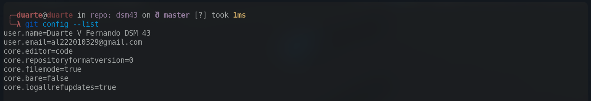
 o si bien deseamos un parametro en especifico usamos
 >`git config "Parametro"` __*cabe resaltar que no se deberian colocar las comillas*__

__*Ejemplo*__
>`git config user.name`.
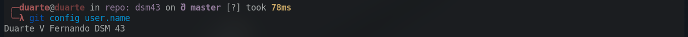

Para obtener ayuda de la gran mayoria de comandos proporcionados por git 
>`git help`. 
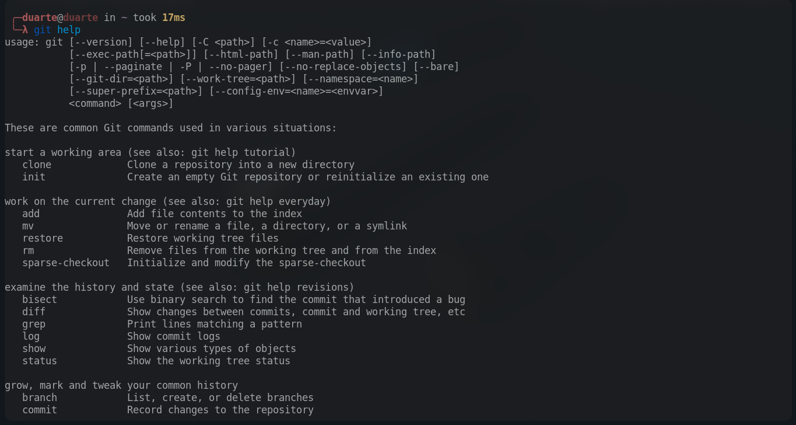
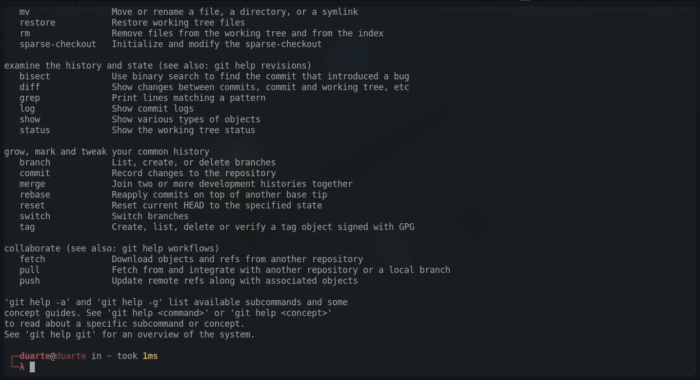

_______________________________________________________

### Iniciar un repositorio de GIT.

Para iniciar un repositorio en git previamente debimos haber realizado la configuración de usuario
>`git init`.

Para empezar a añadir nuestro trabajo se haria de la siguiente manera
>`git add *` 

si deseamos añadir todo el contenido dentro de la carpeta, o si bien deseamos solo un contenido en especifico se haria de la siguiente forma 
>`git add "Nombre_documento"` 
__*cabe resaltar que no se deberian colocar las comillas*__.

__*Para que nuestros documentos sean guardados debemos añadir un comentario con los cambios añadidos*__ para ello usaremos 
>`git commit -m "Comentario con los cambios"`

__*Ejemplo*__

`git commit -m "Añadimos todos los archivos". 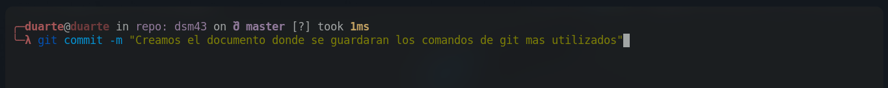

Para clonar contenido de algun repositorio dentro de Github y __*derivados primero debemos obtener la URL*__
>`git clone https://github.com/Du-F23/angular-api.git` 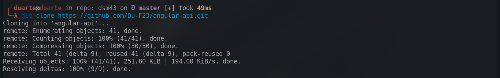
O si queremos que se guarde en un directorio con nombre en especifico `git clone https://github.com/Du-F23/angular-api.git nombre_carpeta`
>`git clone https://github.com/Du-F23/angular-api.git Prueba`.
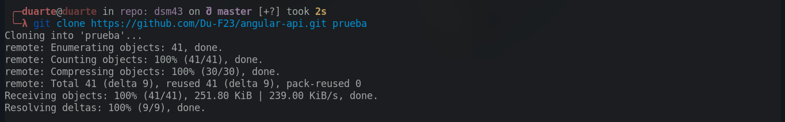.

Para verificar el estado del repositorio
>`git status`.
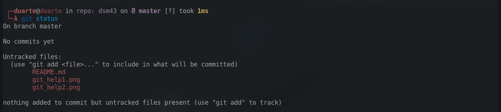

Si no queremos que se añadan carpetas o documentos en especifico a el repositorio

>touch .gitignore 
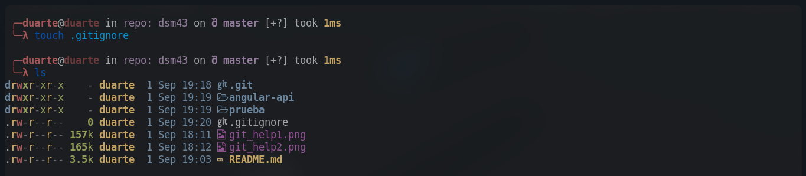
__*Aqui editaremos el archivo llamado .gitignore y añadiremos las carpetas excluidas por nosotros*__.
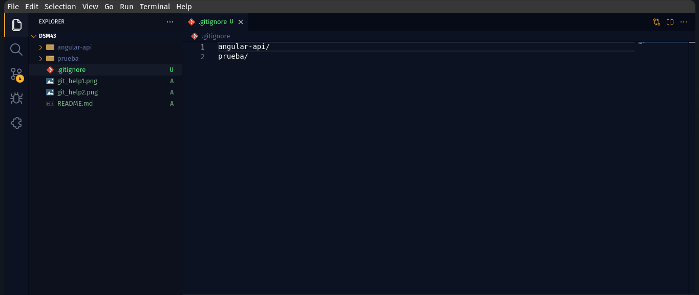

Para eliminar archivos del area de preparación 
>`rm nombre_archivo`

__*Ejemplo*__

`rm indes.html`.

Para renombrar archivos en git 
>`mv nombre_actual nombre_nuevo`

__*Ejemplo*__

`mv arrachera.jpg taco_arrachera.jpg`.

Para ver el registro de confirmaciones 
>`git log`
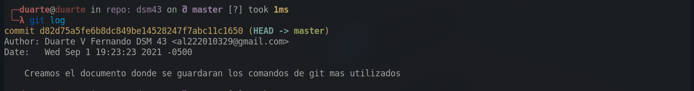

Para añadir remote de algun repositorio.
`git remote add origin URL`.

__*Ejemplo*__
>`git remote add origin https://github.com/Du-F23/comandos_git.git`

Para ver todos los repositorios remotos o clonados
>`git remote -v`
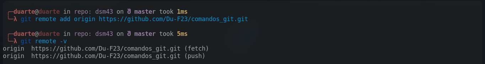

______________________________________

### Creacion de alias para comandos de git

>`git config --global alias.nombre_alias accion`

__*Ejemplo*__

`git config --global alias.ci commit`
y para mandar a llamar a nuestro alias seria de la siguiente manera
`git ci -m "Creamos un alias"`. 
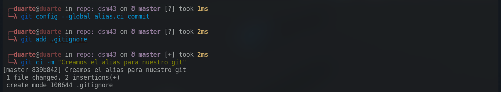

________________________________________

## Ramas en git

### Creacion de una nueva rama

>`git branch -M nombre_rama` 
podemos crear diferentes ramas pero las mas comunes son __*master y main*__.

__*Ejemplo*__ 

`git branch -M master`
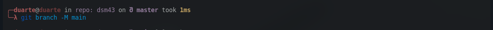

### Subir rama a repositorio remoto 
>`git push -u origin nombre_rama`

__*Ejemplo*__

`git push -u origin main`
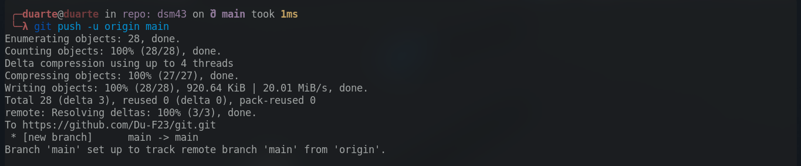
